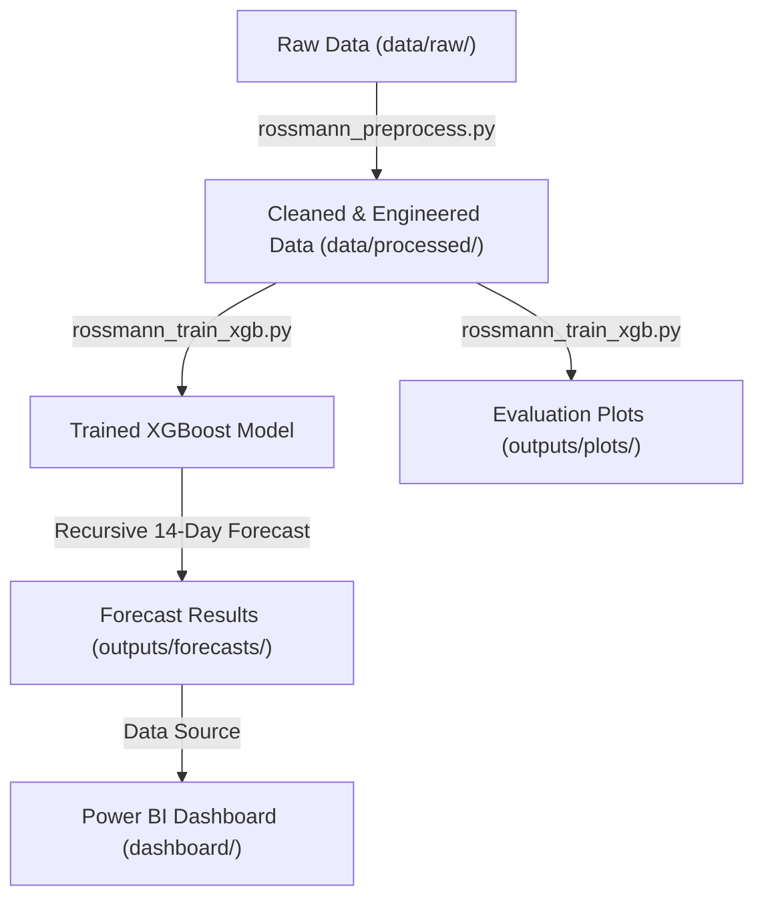
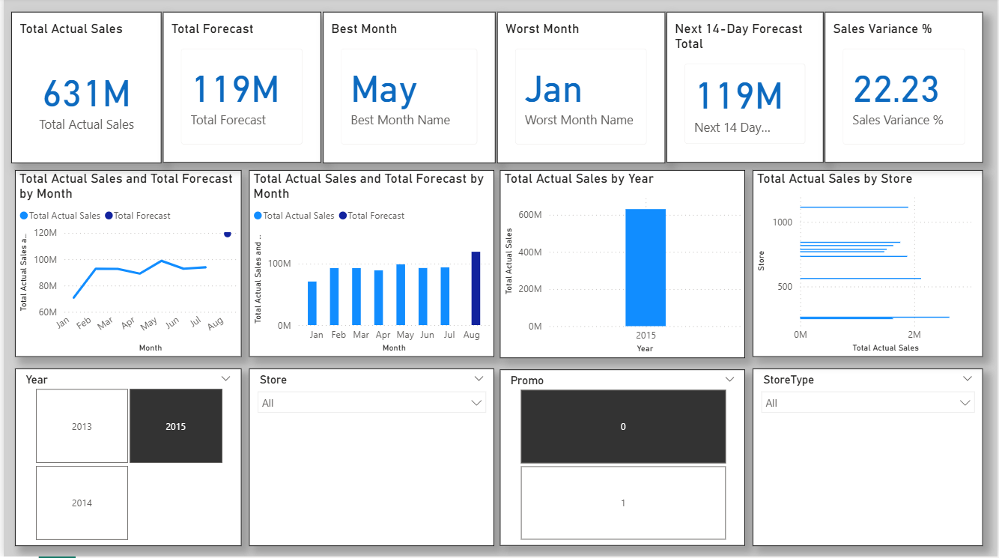

# AI-Powered-Sales-Forecasting-Dashboard

An end-to-end Machine Learning pipeline and Business Intelligence solution that preprocesses retail store data, trains an XGBoost model with recursive multi-step forecasting, and visualizes predictions through an interactive Power BI dashboard.

---

## 📌 Project Architecture



---

## 🚀 Key Features

* **Recursive Multi-Step Forecasting**: Implementation of an autoregressive loop that feeds predictions back as features (lags and rolling averages) to forecast up to 14 days out without drift.
* **Feature Engineering**: Automatic generation of lag features (1, 2, 3, 7, and 14 days) and 7-day rolling means (shifted to prevent data leakage).
* **Granular Store-Level Support**: Supports training a global model or targeting individual stores. (For example, Store 1 achieves an impressive **10.46% MAPE**).
* **Robust Validation Framework**: Automatically splits data to evaluate performance on a 14-day holdout set before retraining on the full dataset for final forecasting.
* **Auto-generated Visualizations**: Automatically exports feature importance (gain) and actual vs. predicted validation plots on every run.
* **Power BI Optimized**: Auto-formats output data to seamlessly refresh the interactive dashboard.

---

## 📁 Repository Structure

```
├── dashboard/
│   ├── sales_forecast_dashboard.pbix   # Interactive Power BI report
│   └── dashboard_overview_1.png        # Dashboard visuals
├── data/
│   ├── raw/                            # Raw datasets (from Kaggle)
│   └── processed/                      # Preprocessed output
├── outputs/
│   ├── forecasts/                      # Exported CSV predictions
│   ├── models/                         # Serialized model binaries
│   └── plots/                          # Feature importance & validation curves
├── src/
│   ├── rossmann_preprocess.py          # Data cleaning & merging
│   └── rossmann_train_xgb.py           # Training, evaluation & forecasting
├── requirements.txt                    # Python library dependencies
├── run.py                              # Unified pipeline orchestrator
└── README.md                           # Documentation
```

---

## ⚙️ Installation & Setup

1. **Clone the repository**:
   ```bash
   git clone https://github.com/AashishPoddar/AI-Powered-Sales-Forecasting-Dashboard.git
   cd AI-Powered-Sales-Forecasting-Dashboard
   ```

2. **Set up virtual environment & install dependencies**:
   ```bash
   python -m venv venv
   source venv/Scripts/activate  # On Windows: venv\Scripts\activate
   pip install -r requirements.txt
   ```

3. **Add the Raw Data**:
   Place the raw Kaggle Rossmann Store Sales dataset files under `data/raw/`:
   * `rossmann_train.csv`
   * `rossmann_store.csv`

---

## 💻 Usage

The pipeline can be executed seamlessly using the `run.py` orchestrator in the root directory.

### Run the Entire Pipeline
This runs data preprocessing, trains the model globally, evaluates it, and saves the forecast outputs:
```bash
python run.py --horizon 14 --rounds 200
```

### Run Store-Specific Forecasting
To forecast sales for a single store (which yields significantly lower error margins, e.g., ~10% MAPE):
```bash
python run.py --skip-preprocess --horizon 14 --rounds 100 --store 1
```

### Options & CLI Arguments
* `--skip-preprocess`: Skips preprocessing the raw CSV files if `data/processed/rossmann_processed.csv` already exists.
* `--horizon <days>`: Number of days into the future to forecast (default: `14`).
* `--rounds <int>`: Number of boosting rounds for XGBoost training (default: `200`).
* `--store <store_id>`: Filters training/prediction to a specific store ID. If omitted, aggregates globally.

---

## 📊 Evaluation & Visualization Outputs

On every training run, the pipeline exports two visual plots under `outputs/plots/`:

1. **Feature Importance Plot (`feature_importance.png`)**: Ranks model features based on fractional split gain.
2. **Validation Curve (`val_actual_vs_pred.png`)**: Compares actual historical sales against model predictions over the 14-day holdout validation window.

---

## 🖥️ Dashboard Tour

The Power BI dashboard provides key executive metrics including:
* **Total Actual Sales vs. Forecasted Sales**
* **Sales Variance & Best/Worst Month Performance**
* **Dynamic Slicers** by Year, Store, Store Type, and Promo Status.


